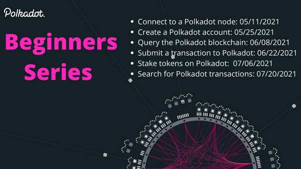

# A beginner series

## To unpack some of the web3 lego builidng blocks

### Banner



### Details

Join us to learn about the Polkadot and Acala ecosystem. These will be hands-on lab-style sessions designed for anyone to learn. All steps and code will be provided making it easy for beginners to follow along.

The aim of this beginner series is to provide a hands-on experience for everyone, such that one can:

1. Connect to a Polkadot node
2. Create a Polkadot account
3. Query the Polkadot blockchain
4. Submit a transaction to Polkadot
5. Stake tokens on Polkadot
6. Search for Polkadot transactions

### Chain | Node | Telemetry | Health-Check | RPC-Endpoint

```
chain: westend
node: 🌸
telemetry: https://telemetry.polkadot.io/#list/Westend
health-check: curl http://westend.rpc.acala.uno:1111/health
rpc-endpoint: http://westend.rpc.acala.uno:1111
```
